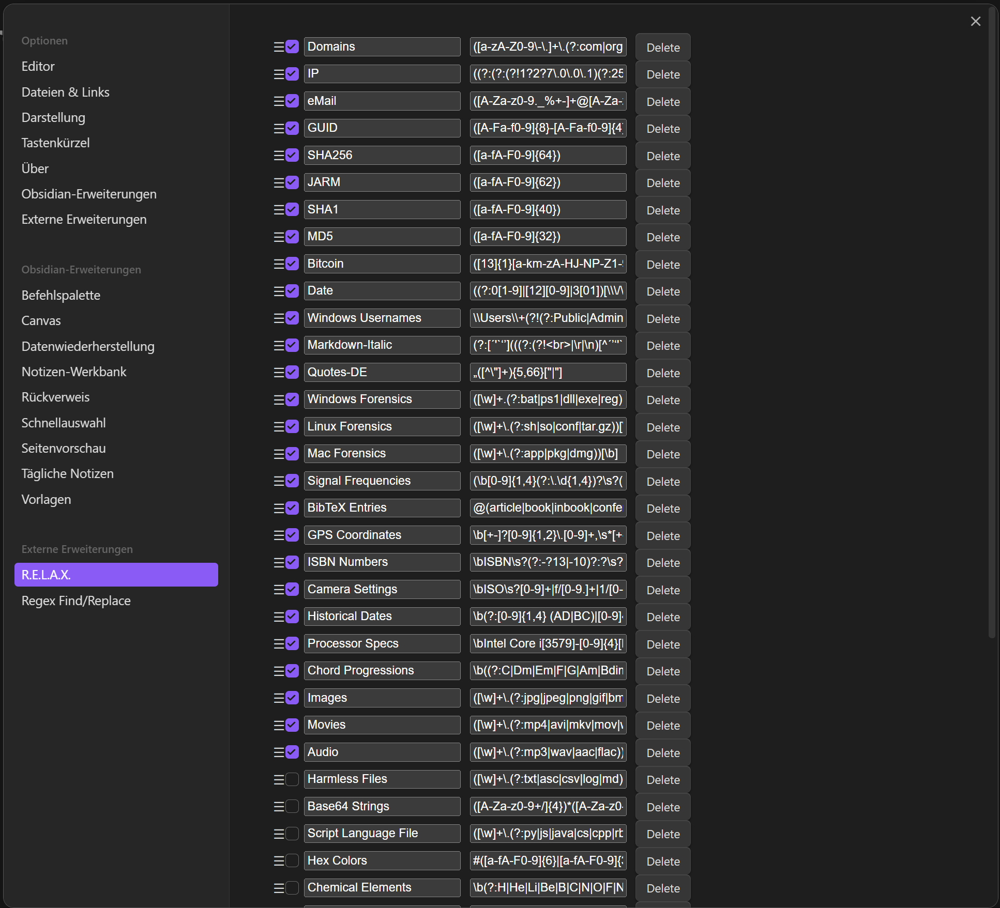

  
  <h1 align="center">R.E.L.A.X. (Regular Expression Link Analysis Xpert)
   
  
  
  
  
  </h1>

Enhance your Obsidian experience with R.E.L.A.X., a powerful plugin that leverages regular expressions for dynamic and intelligent note linking.

### Features That Let You Chill:

- **Semiauto-Linking Magic:** Forget manual linking. Rightclick, let the regex patterns do the heavy lifting.
- **Chillax with Organization:** Watch your notes find their buddies, automagically.
- **Customizable Patterns:** Your rules, your regex. Tailor them to fit your groove.
- **Smooth Obsidian Ride:** Like butter on a hot skillet, it integrates seamlessly.
- **Fun with Regex:** Not just powerful, but also a playground for your regex skills.

### Why Should You R.E.L.A.X.?

Embrace a workflow that's as chilled out as a lazy Sunday afternoon. Discover connections in your notes that you didn’t even know existed. Let your creative juices flow uninterrupted while R.E.L.A.X. takes care of the mundane.

### Get Started:

1. **Install:** Plug it into Obsidian with zero hassles.
2. **Set Your Regex:** Dial in your preferences.
3. **Watch the Magic:** Update inside your selection, or the whole file or even whole folders recursively. Rightclick->There you go!

## Installation:

1. **Access Obsidian Settings:** Open your Obsidian application and click on the 'Settings' icon.
2. **Enable Community Plugins:** In the Settings, navigate to 'Community Plugins' and turn off 'Restricted Mode'.
3. **Browse and Install Plugins:** Click on 'Browse' and find the R.E.L.A.X. plugin.
4. **Install the Plugin:** Click 'Install' on the plugin’s page.
5. **Enable the Plugin:** Toggle it on in the 'Installed plugins' section.
6. **Configure the Plugin (Optional):** Set up the plugin in its settings panel.
7. **Start Using the Plugin:** Begin your seamless Obsidian experience.

## Screenshots:

### Community & Support:

- **Forums & Discord:** Chill with fellow users on [Obsidian Forums](#) and [Discord](#).
- **Need Help?:** Holler on our [GitHub](#).

### License:

R.E.L.A.X. comes with an MIT License - free to use but at your own risk. Check [LICENSE](#) for more details.

### Contributions:

Got ideas? Sprinkle your magic in [CONTRIBUTING.md](#).

### Shoutouts:

Big thanks to the Obsidian crew and all the brilliant minds behind this project.

#### Support R.E.L.A.X.:

Enjoying R.E.L.A.X.? [Why not buy me a coffee then?](https://buymeacoffee.com/Syr1) so I can relax even more!
